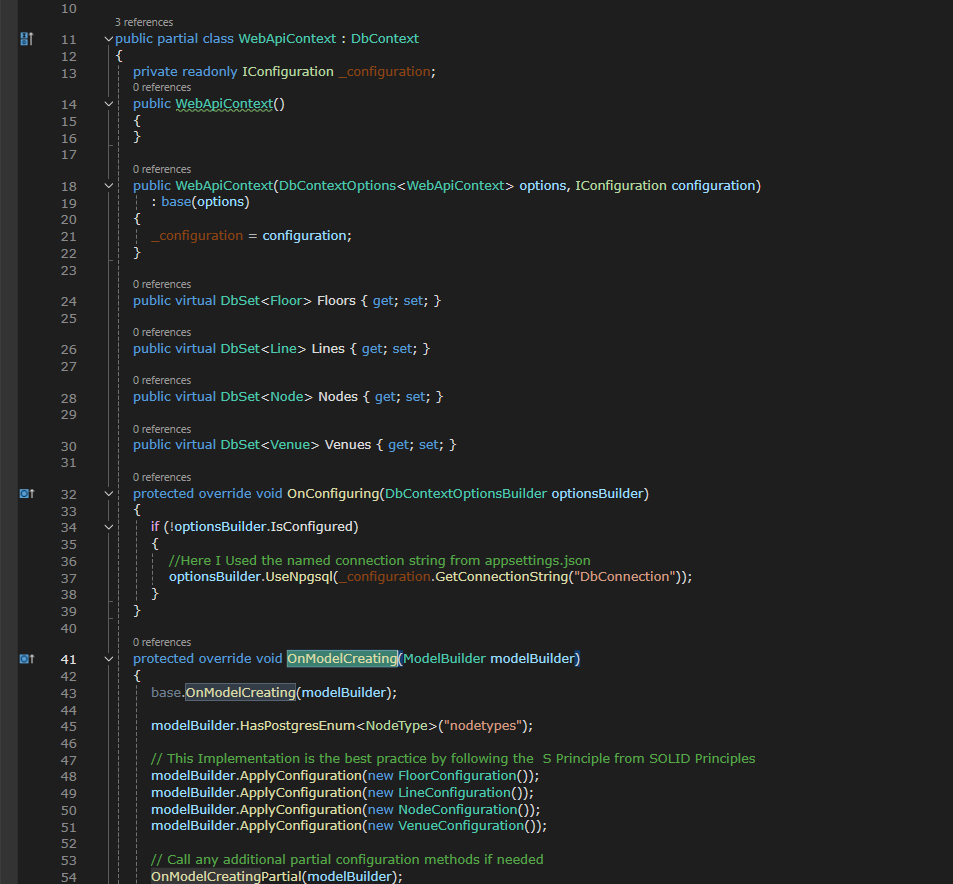

# Hareth Location Services API Project
## WebApplication_Documentation

## Overview
This repository contains an API project built using ASP.NET Core 8.0, following the Clean Architecture pattern and Database-First approach ***(Manual Modling Methodology)***. The project uses PostgreSQL as the database system, and pgAdmin 4 for database management. The development environment is Visual Studio 2022.

## The Steps I took to Build the Application

### 1. **Database Setup**:
   - Create the ERD.
   - Create a PostgreSQL database named "WebAPI" using pgAdmin.
   - Design and create four tables: `venues`, `floors`, `nodes`, and `lines`.
   - Define an enum called `nodetypes` to represent different node types.

   
   


### 2. **Create the API Project**:
   - Set up a new API project in Visual Studio 2022 named "WebAPI".
       .

   - Delete the default `WeatherForecast.cs` file and `WeatherForecastController.cs`.
   
        

### 3. **Install Packages**:
   - Use NuGet Package Manager to install necessary packages (e.g., Entity Framework, Npgsql).

   

### 4. **Connect the DataBase**:
   - Create the **Connection String** and include it in the `Appsettings.json` file, for posql the connection String pattern is:
   
    ```
     "ConnectionStrings": {
        "DbConnection": "Host=localhost;Database=WebApiApp;Username=postgres;Password=Put You're pass"
    }
    ```
  - Create the AppDbContext file and make the ***OnConfiguring*** Methode and later on the OnModelCreating Methode and the DbSet's.

  - Register the Connection String in the **Program.cs** file

        ```
            //Configure DbContext
            builder.Services.AddDbContext<ApplicationDbContext>(options =>
             options.UseNpgsql(builder.Configuration.GetConnectionString("DbConnection")));

        ```

     - Create the Database Configurations:

        

     ---
### 5. **Create the Models**
 - Create the Models based on the DB Entities
    
 
 - Apply the Configurations and set the Entities in the DB using `DbSet<>` 
 

### 6. **Create the DTOs**
   

### 7. **Models Mapping**:

   - Install Mapster Package by Run: `Install-Package Mapster` in the **NuGet package Console** 
    - Mapping the Data between the main Models and the DTOs (each Model in a file)
     
    
   - Register the Mapster Confgurations in the **Program.cs** file
     

### 8. **Create the **Interfaces and Repositories** and Implement them in `Program.cs` file**:

   
      
   - Program.cs
   - 
     

### 9. **Create the Controllers and Create the GetAll method for each Entity**:

   

   
    
### 10. **Create GenericRepository, IGenericRepository files and register them in the `Program.cs`  file:**
 
  -
    
 ---
  - Register Code in the `Program.cs`  file

  ```
  builder.Services.AddScoped(typeof(IGenericRepository<>), typeof(GenericRepository<>));
  ```

### 11. **Implement CRUD operations (Create, Read, Update) using both Entity-Specific Repositories and Generic Repositories, excluding the Delete method.**
 
 
 ---
 
 
### 12. **Change the IsDeleted Prop to be an UpdateStatus Enum and Include three status inside it: New, Deleted and Updated**
   
   - Create the Enum:
      
    
     - Do the right Configuration using Mapster:
     
     
     - Update the Node Db Configuration and add it as a table:
     
           builder.Property(n => n.UpdateStatus)
                .HasColumnName("update_status");
      
            builder.Property(e => e.NodeType)
           .HasColumnName("node_type");


      - Deal with the Enum as string in the Update Method:
           
         `NodeType = Enum.Parse<NodeType>(nodeDto.NodeType)`

### 13. **Create the Services:**
   - Create an a Service Interface for each Entity
   - Create a Service for each Entity
 
   

  - **Why to Make Services?**
   -  Handle business logic and orchestrate operations across multiple repositories.
   - Can be reused across different controllers or other services, promoting DRY (Don’t Repeat Yourself) principles.
   - Keeping business logic in services makes it easier to maintain and update without affecting controllers.
   - Services can be unit tested independently of the controllers, ensuring that business logic is correct.
 


### 14. **Implement Delete Method**

> The Delete Method should perform a soft delete by changing the `UpdateStatus` to `UpdateStatus.Deleted`.

> For the Delete method, we should delete the related entities for the entity we want to delete. To achieve this, we should create delete methods for related entities and use transactions.

- **Implement Delete Methods in Related Entities**:
  Implement delete methods for both related entities associated with the Floor entity (Lines & Nodes).
       
        

- **Implement Delete Method for the Floor Entity**:
  Implement a delete method to delete the floor itself.
  

- **Define and Implement Transaction Methods in Generic Repository**:
  Define and implement transaction methods in the generic repository to ensure atomic operations.
  

- **Inject Generic Repository into Floor Service**:
  Inject the generic repository into the Floor Service to manage transactions.

- **Implement Delete Method in Floor Service**:
  Implement the delete method in the Floor Service and call the necessary methods inside it.
  

- **Implement Delete Method in Floor Controller**:
  Implement the delete method in the Floor Controller to expose the delete functionality via an API endpoint.
  

 ---
## Challenges

During the development of this project, I encountered several challenges:

1. **Enum Mapping**:
   - Integrating the `NodeType` enum with the database required manual adjustments.
   - Understanding how EF Core maps enums to integer columns was a learning curve.

2. **Connection String Security**:
   - Handling connection strings securely was crucial.
   - I followed best practices by storing sensitive information outside the source code.

3. **Database First Approach**:
   - Coordinating the existing PostgreSQL database schema with the generated proxy classes was essential.
   - Ensuring that the models accurately reflected the database structure was challenging.

## Resources

Here are some helpful resources that I used during this project:

1. [Entity Framework Core with PostgreSQL — Database First article.](https://medium.com/@ankushjain358/entity-framework-core-with-postgresql-database-first-ab03bf1079c4)

2. [Setup PostgreSQL in .NET with Entity Framework](https://www.youtube.com/watch?v=z7G6HV7WWz0&t=182s).

3. [pgAdmin Documentation - Npgsql Entity Framework Core Provider](https://www.npgsql.org/efcore/)


----
